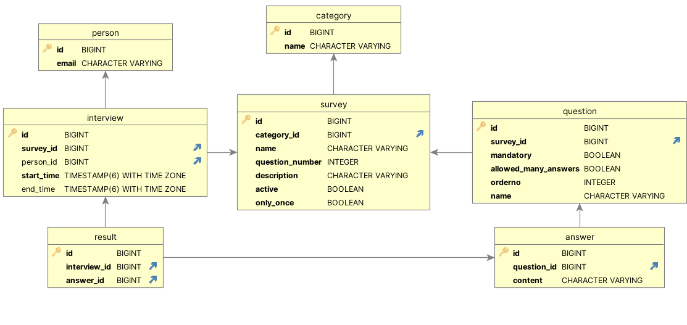

# Описание проекта
MVP для работы с анкетами.

## Используемые технологии

- ASP.NET Core 8.0
- Entity Framework 8.0.0
- PostgreSQL 16

## Файл баз данных

Скрипт для создания и заполнения БД [init.sql](/Repository/init.sql).

## Описание спроектированной БД


P.S. Между "Анкета" и "Вопрос", а также "Результат" и "Ответ", как мне кажется, также возможны связи и
М:М, но для такой реализации необходимо иметь некий конструктор форм, что уже не делает приложение простым. 

P.P.S. Основные индексы были созданы по внешним ключам для ускорения JOIN-операций, а также для фильтрации анкет по
имени категории. Создание большего количества индексов на полях, у которых нет функциональных требований, 
будет только замедлять работу небольшого приложения.

# Запуск

Чтобы поднять приложение, нужно открыть папку с проектом и последовательно выполнить следующие команды:

```
docker compose build
docker compose up
```

Протестировать API можно по следующему адресу:

```
http://localhost:8080/swagger/index.html
```

